# NITT ONLINE PORTAL 
An Initiative by **INDRESH P** for conducting online classes for _NITT Students_

## Requirements
[NODEJS](https://nodejs.org/en/download/)
[MONGODB](https://www.mongodb.com/)
    
## Premier Technologies Used
[ReactJs](https://reactjs.org/)
[Redux](https://redux.js.org/)
[NODEJS](https://nodejs.org/en/download/)
[Bootstrap](https://getbootstrap.com/)
[Socket.io](https://socket.io/)
[Simple-Peer](https://www.npmjs.com/package/simple-peer)

## Heroku Deploy
https://nittonlineportal.herokuapp.com

## Starting With
### To install all dependencies 
```sh
git clone https://github.com/indreshp135/deltaFinalProject
cd deltaFinalProject/database\ collection\ creator
npm install
cd ../nittonlineportal
npm install
cd client 
npm install
```

### To edit environment variables
>Change PORT value in package.json->proxy. This must match with server PORT. You can change PORT value of client in react-start script. By default it is 3000.
```sh
cd ..
code .env
```
>Make necessary changes as directed. 
```sh
cd ../database\ collection\ creator
code .env
```
>Make necessary changes as directed

### To create default database 
```sh 
node index
```
>Wait for these messages<br>
```Server started on PORT :**_some_port_set_as_env_variable**```<br>
```Mongodb connected...```<br>
Run localhost:$PORT$ and wait till this message
```database creation done```

### To start the application 
```sh
cd ../nittonlineportal
npm run dev
```
>React application by default opens in localhost:3000 <small>This can also be changed<small> 

## Working 
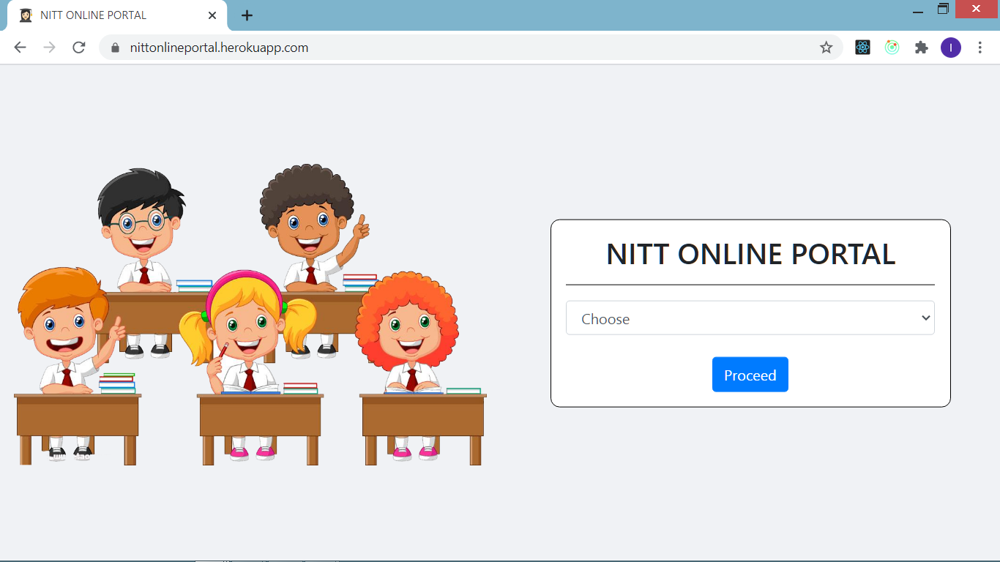<br>

>Choose Professor/Student and proceed to login site Login or Register<br>

### Register
>A professor needs to register with following informations<br>

    Name
    Any Email ID
    Department
    Password

>whereas as student need to register with 

    Name
    NITT Register Number
    Password

>A verification email will be sent to registered email(professor) NITT webmail for students. <br>
>In case of any discrepancies register again portal will prompt whether to resend verification email.<br><br>

<image src="screenshots/s2.png" width="60%" >
<image src="screenshots/s3.png" width="60%" >
<image src="screenshots/s4.png" width="60%" >  

### Login
>After verification try login. Webpage will alert in case of any errors <br><br>

<image src="screenshots/s5.png" width="60%" >
<image src="screenshots/s6.png" width="60%" >
<image src="screenshots/s7.png" width="60%" >

### Homepage 
>The whole webapp has two modes **DARK** and **LIGHT** mode.<br><br>
<image src="screenshots/s8.png" width="45%" >
<image src="screenshots/s9.png" width="45%" >

#### Icons In Navbar 

    HomeIcon       -  To reach homescreen from any other tabs
    Sun/MoonIcon   -  To toggle between dark and light mode
    LogoutIcon     -  To logout

#### Sidebar

>This gives details about ourselves.<br>
> In student portal few details are auto-generated based on NITT register number.<br><br>
<image src="screenshots/s10.png" width="40%" >

#### Profile Picture
>We can upload/update our profile picture <br>
>They are also used in *Chat* tab in student portal<br>
>Upload only JPG/JPEG files<br>
>Size limit is mentioned to be below 1MB but upto 10MB is allowed. <br>

<image src="screenshots/s16.png" width="30%" >

### CR
>CR of the class have some special access<br>
> He/She can edit timetable<br>
> He/She can end ongoing poll<br>
> He/She can request professor to start an online class<br>
>CRs can appointed by any professor if he/she has registered.

### Professor Joining Class
>Profesor can join a class by providing details of year, department and coursecode<br>
>Course Code will get get added to the class and all students can view that in **Study Material** tab that displays Course Code and Professors name.<br>
>Whenever Professor Uploads any Study Material they come in this **Study Material** tab of Students <br>
>To keep track of classes joined by professor a table is provided below in **Join Class** tab <br>

<image src="screenshots/s12.png" width="49%" >
<image src="screenshots/s11.png" width="49%" >

### Appointing a CR
>Professor can appoint CR<br>
>If he has not registered it will automatically prompt with *not registered* message.<br>
>If he has registered he will become CR of that class and that account will have a CR badge with some special accesses<br>

<image src="screenshots/s14.png" width="49%" >
<image src="screenshots/s13.png" width="49%" >

### Study Material 
>Professor selects a class and course code to upload any study materials.<br>
>This can be accessed in student's *Study Material* tab the next time he/she login <br>
>Once the student clicks the link a new tab opens where he can download them<br>
>StudyMaterials download wouldn't work properly when hosted locally. Because server and client runs in different ports. But they work perfectly when deployed. To check, change the localhost port from client port(generally 3000) to server port in the new tab that popped<br>
>Multer, GridFs are some of the technologies used for this.

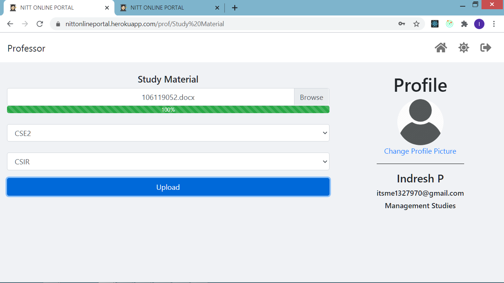
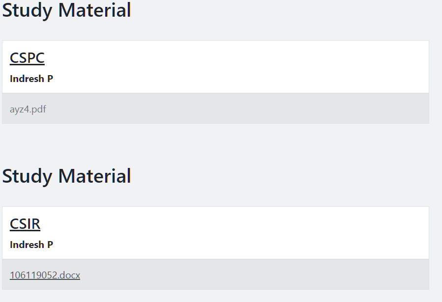

### Publish Results 
>Profesor can send results to his students who has already registered in this portal <br>
>If he/she has not registered yet there will be a prompt for that in the website<br>
>These results can be seen in **Results** tab in student portal the next time he/she login.<br>

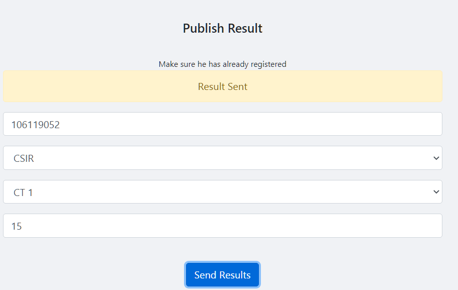


### Polls
>Students can create polls and vote their choise <br>
>If there are more than one ongoing polls they can vote them one-by-one<br>
>CR can end a poll and he can see how many votes each option has got. *Note*:Only CR can see.<br>
>Once CR ends a poll, result will be automatically declared in Resulted Polls table.<br>
>Voting Privacy is maintained<br>
>Ofcourse a person can vote only once.<br>

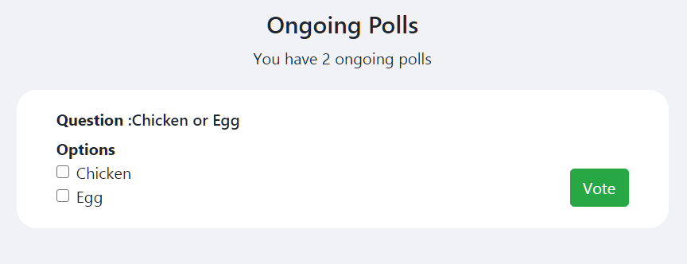
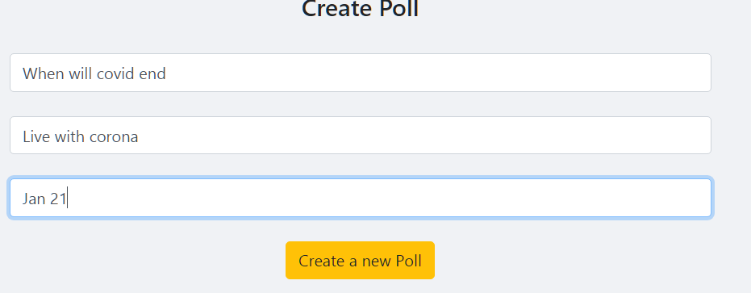
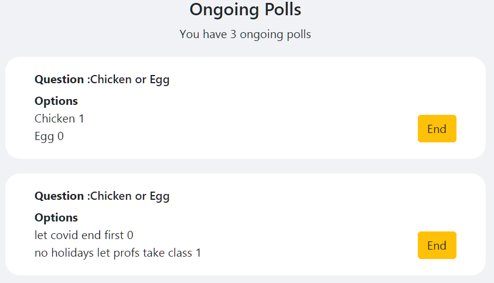
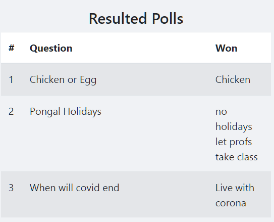

### Timetable
>Students can see their *Timetable* in here <br>
>Only CRs can edit them <br>
>CRs can select a hour by clicking on the timetable to edit them.
>Even Profs can create and edit one for their own,<br>

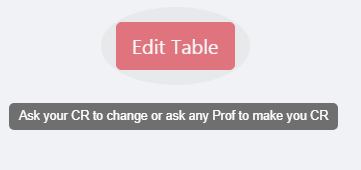
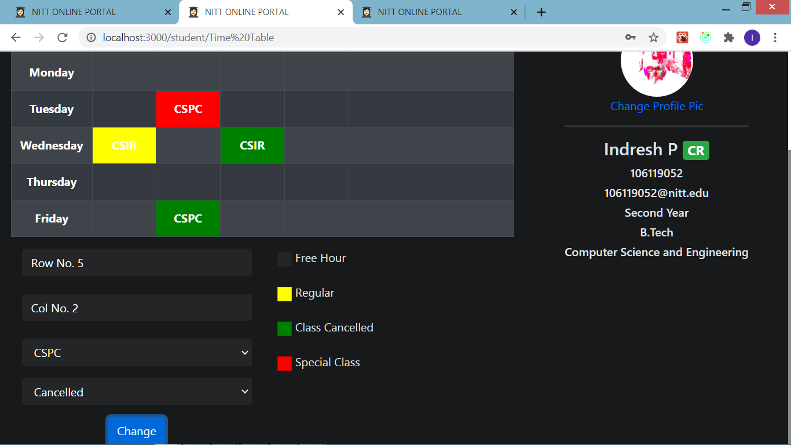

### Chat 
>This helps students discuss about topics within class group<br>
>Sockets are used hence this is realtime<br>
>Sender's profile pic and name will also ne displayed along with their message<br>
>Messages are also saved in database<br>

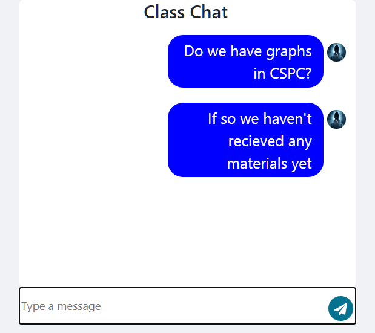
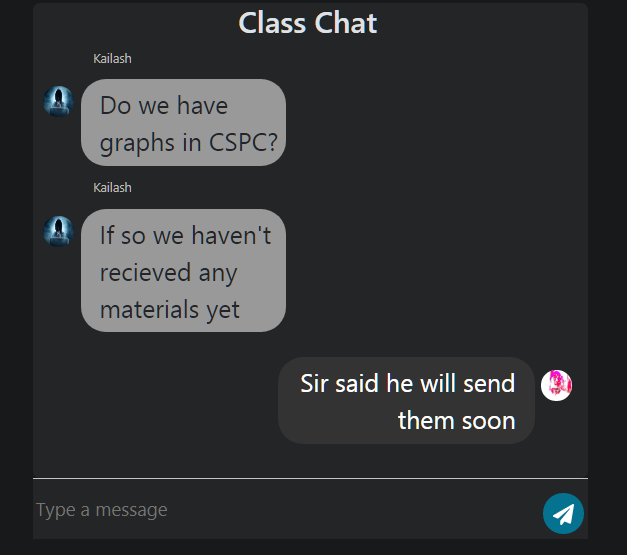


### Online class
>A professor can create a virtual classroom 

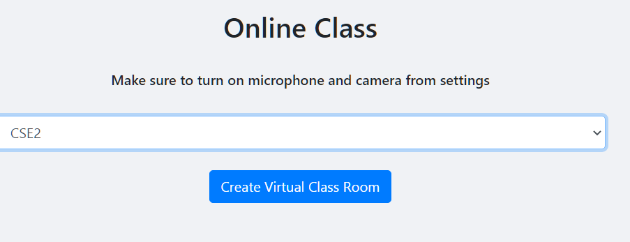

>When Student stays on **Online Class** tab or if he/she login after professor has created the virtual classroom and before he starts class they will get a call to join class

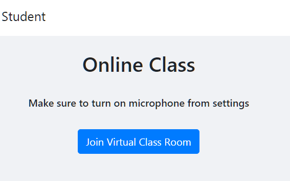

>They all will be in a waiting room

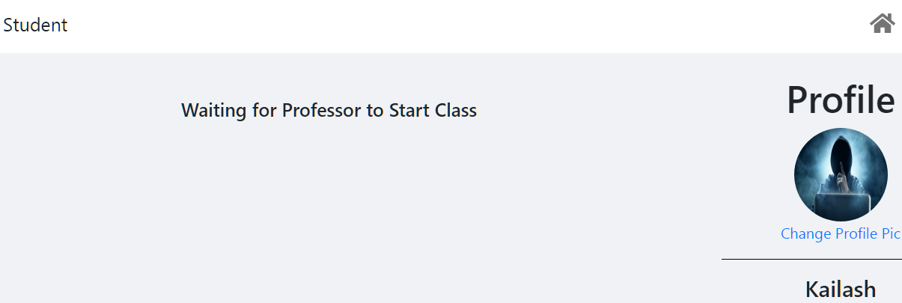

>Professor has to wait till the CR request to start class ( this is for CR to ensure students have joined )<br>
>As soon as CR sends request start button gets enabled and Professor can start his class(after he starts his class no one can join)

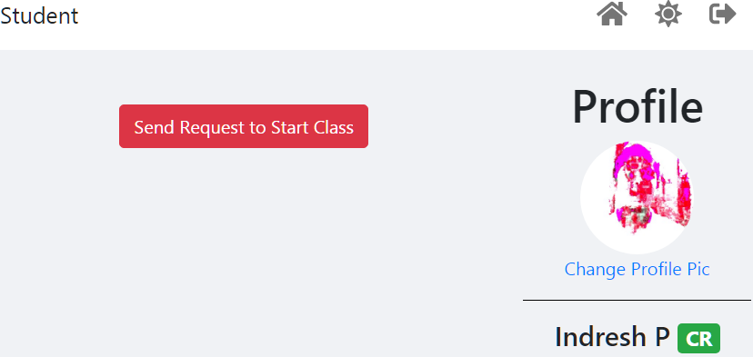

>After he end the class all he and the students will be back to their home page.

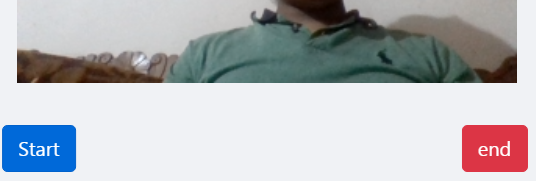

>Simple-Peer and Socket.io is used for this


## Behind the screen 
>It is not just `MongoDB`(database) `Redux` plays very important role in this webapp<br>
>Instead of requesting each and everytime, one *`STATE`* tree is maintained that holds all the value <br>
>This improves efficiency.<br>
>This state tree is stored in `SessionStorage` so that it is not lost after refresh.<br>


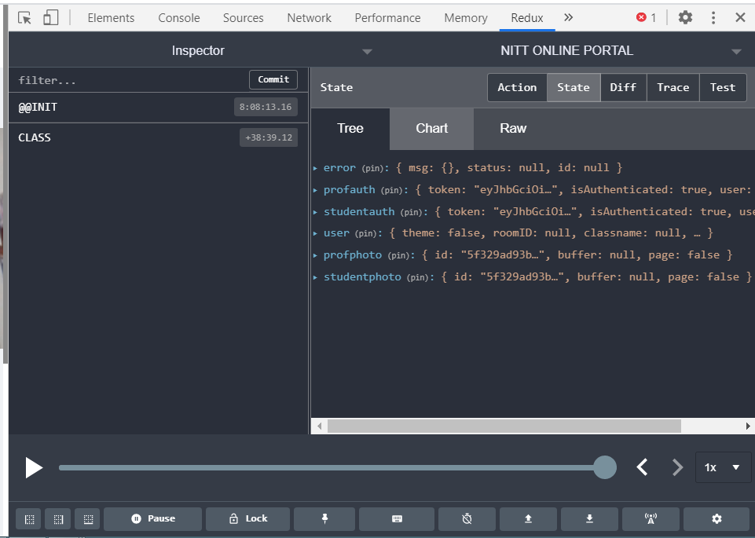

>Moreover Sockets are use to enable real-time connectivity

## Todos
Enable attendance management system<br>
Enable Communication between Professor and Students <br>
Assistance for assignment submission <br>
Assistance for conducting CTs MidSems etc...<br>
Automatic Removal of Data after a semester<br>
Herokuapp site is not secure. SSL certication must be added!<br>

## Issues
Sockets must be used in many other tabs which will enable real-time updates of *`REDUX STATES`*. Like if a professor sends studymaterials, student can't see them if he is already online. Students can see them only on their next login<br>
Sockets only works in Chat and OnlineClass tabs. Socket listening doesnot happen when student is in some other tabs<br>
Online Class tab is bit shaky. It uses complete graph peer(one person is connected with every other person in that room ie nC2 peers), which can be changed to star graph(every student connecting with professor n-1peers). Though changing this improves efficiency, one student can't listen to other student's audio<br>
